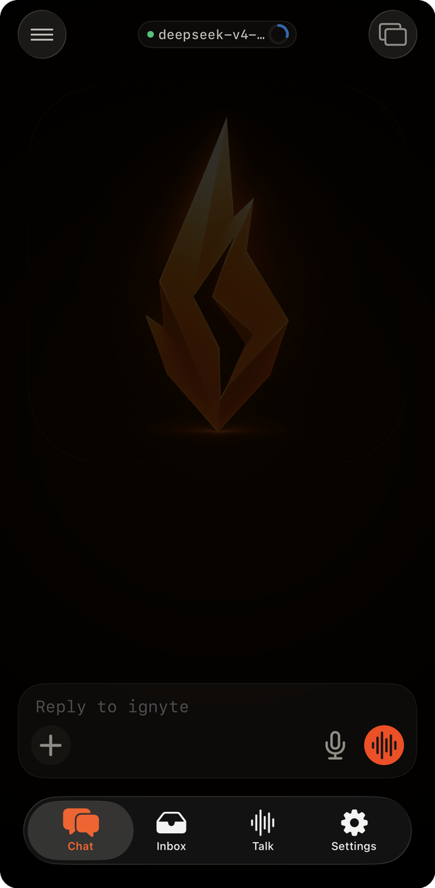
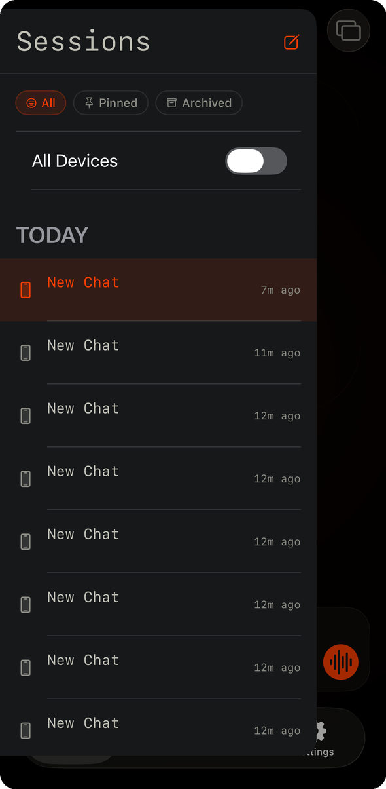
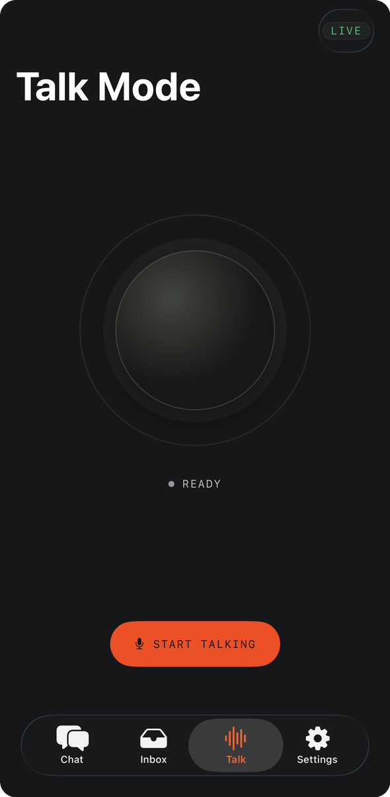
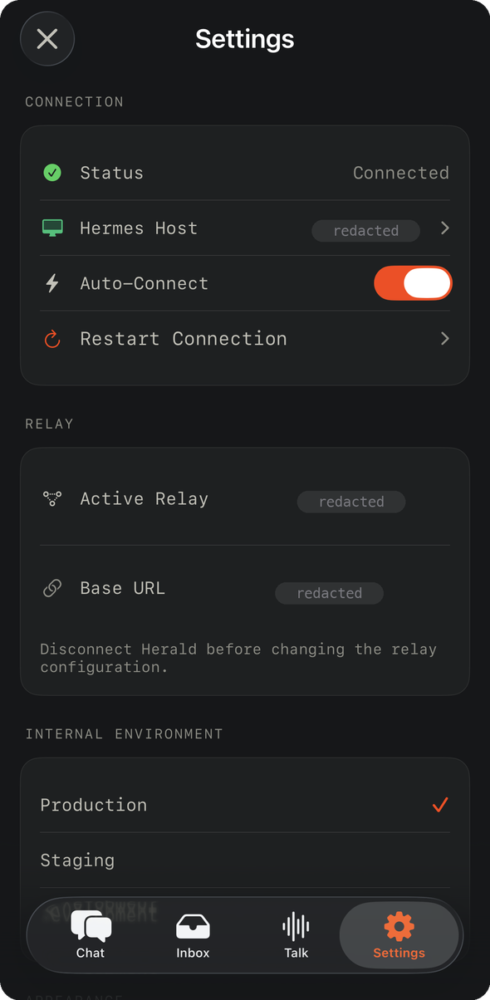
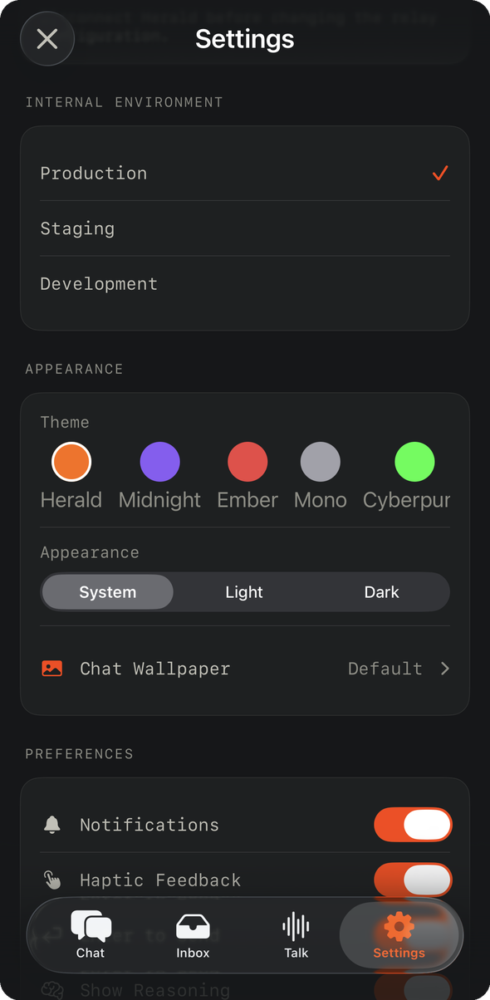
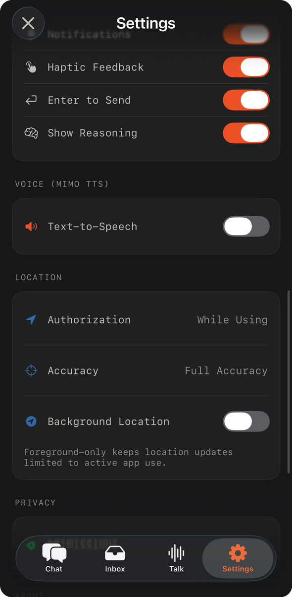

# Herald — Code Review & Handoff for Codex (2026-07-20)

> **Purpose:** independent double-check of the v1.7.0 "durable streaming + Hermes-native Talk"
> work (commit `099c0cd`), plus the docs/screenshot handoff that follows from it. This is a
> **read-only review** — no code was changed while producing it. Every claim is grounded in
> `file:line` against the working tree at `099c0cd` (branch `master`, clean). Companion
> process doc: `HERALD_PROJECT_BRIEF.md` (read §9 for the house rules). Upstream reference
> used for the streaming contract comparison:
> [hermes-agent gateway](https://github.com/NousResearch/hermes-agent/tree/main/gateway) —
> `stream_events.py`, `stream_dispatch.py`, `stream_consumer.py`, `status.py`,
> `systemd_notify.py`, `turn_lease.py`.
>
> **Headline:** v1.7.0's CHANGELOG claims durable streaming and Hermes-native Talk shipped.
> The iOS-side scaffolding landed, but **both features are non-functional end-to-end**:
> streaming dies at relay ingestion (every event after the first is silently dropped), and
> the Talk coordinator is never constructed, so the Talk button is a silent no-op. Details
> and fix paths below, P0 → P2. Part II covers the screenshots staged for publication and
> the README/GitHub update instructions.

---

## Cross-cutting rules (restated from the brief — apply to every fix)

- Bump version everywhere (`project.yml` both targets, README badge, CHANGELOG, in-app label).
  One logical change = one commit = one dated CHANGELOG entry.
- Relay has **no migration framework** — schema changes ship exact manual `ALTER` statements.
  (None of the P0 fixes below require a schema change.)
- Swift 6.2, `SWIFT_STRICT_CONCURRENCY: complete` — new async code must be concurrency-clean.
- Never hardcode secrets. iOS → Keychain; relay/connector → env.
- The Hermes host hard-freezes (OOM history): "accepted but slow" ≠ failure. Watchdogs must
  not re-send slow-but-alive jobs.

## Environment

| Thing | Value |
|------|-------|
| App repo | `/Users/curtisfreeman/Herald` (git, branch `master`, HEAD `099c0cd`, clean) |
| iOS app | `Herald/` target, Swift 6.2, strict concurrency, XcodeGen (`project.yml` = source of truth, currently `1.7.0` / build `36`) |
| Relay | `relay/` FastAPI + SQLite; field deployment reached at host `192.168.10.118:8010` |
| Connector | `connector/src/herald_connector/`; WS client; RPC table in `client.py` |
| Hermes host | `fih-ai-host` @ `192.168.10.118` (OOM-freeze history — slow first token is normal) |
| Build machine | MacBook Pro — unlock login keychain before **every** `xcodebuild`; strip entitlements for paid team |
| Bundle / team | `net.fihonline.herald` · `DEVELOPMENT_TEAM 58U7UPFS53` |

---

# PART I — Code review (P0 → P2)

## P0 — Streaming ("streaming not working")

The user-visible symptom: no incremental text ever renders; the reply either pops in whole
after the job finishes or the placeholder spins until the watchdog gives up. Three stacked
defects cause this. **P0-1 alone guarantees zero streaming regardless of the client.**

### P0-1 · Relay durable log silently drops every event after the first

The connector numbers its stream frames with a per-job `sourceSeq`
([connector/src/herald_connector/client.py:984-1022](connector/src/herald_connector/client.py#L984)
— `"sourceSeq": source_seq` on every `job.progress`). The relay's WS handler **throws that
number away**: the `job.progress` branch republishes only `kind`/`delta`/`label`
([relay/app/main.py:2801-2813](relay/app/main.py#L2801)) and never sets `eventId`. Then
`publish_job_event` reads `source_seq = event.get("eventId", 0)`
([relay/app/main.py:278](relay/app/main.py#L278)) — so **every event arrives with
`source_seq=0`**.

`append_job_event` dedupes on `(job_id, attempt, source_seq)`
([relay/app/services.py:1586-1594](relay/app/services.py#L1586)): the first event of an
attempt (usually `started`, seq 1) persists; **every subsequent event matches the
`source_seq=0` duplicate check, returns `None`, and is dropped from the durable log**. The
SSE endpoint only serves what's in the log (`get_job_events_after`,
[relay/app/main.py:2444-2519](relay/app/main.py#L2444)), so clients receive `started`,
keepalives, then a synthesized `done` — no `text_delta` frames, ever.

Note the relay tests won't catch this: they exercise `append_job_event` with distinct
`source_seq` values; the bug is at the WS-handler boundary.

**Fix path (relay + connector, no schema change):**
1. In each WS branch (`job.started` :2761, `job.heartbeat` :2773, `job.progress` :2801),
   pass the connector's counter through: `"eventId": incoming.get("sourceSeq")`.
2. `job.started`/`job.heartbeat` frames from the connector currently carry **no**
   `sourceSeq` ([client.py:947-955](connector/src/herald_connector/client.py#L947)) — give the
   connector **one monotonic per-attempt counter shared by all frame types** so dedupe keys
   are meaningful across the whole stream.
3. In `append_job_event`, only run the duplicate check when a real `source_seq` was provided
   (treat missing/None as "append, don't dedupe") so old connectors keep working.

**Acceptance:** send a chat message; `sqlite3 relay.db "SELECT seq,type FROM job_events WHERE job_id='…' ORDER BY seq"`
shows a full ladder (`started`, many `text_delta`, `done`-adjacent rows), and a second
delivery of the same connector frame (same `sourceSeq`) is still deduped.

### P0-2 · Relay emits v1 SSE; the app's primary parser expects v2 envelopes — and coalesced deltas lose their `id:`

`docs/STREAM_CONTRACT_V2.md` defines the v2 envelope (`contractVersion`, `jobId`, `attempt`,
`seq`, `type`, `payload`). The iOS `JobStreamCoordinator` decodes that envelope first
([Herald/Services/Live/JobStreamCoordinator.swift:183-205](Herald/Services/Live/JobStreamCoordinator.swift#L183)).
But the relay never produces it:

- Non-delta frames send **only the raw payload** as `data:` — no envelope fields
  ([relay/app/main.py:2400-2411](relay/app/main.py#L2400)).
- Coalesced `text_delta` frames are worse: `flushed_delta_frame()` emits
  `event: text_delta` with **no `id:` line at all**
  ([relay/app/main.py:2390-2398](relay/app/main.py#L2390)), so the client can't advance its
  cursor, and the deltas it merged **consume DB seq numbers** the client never sees.
- Terminal frames are `event: done` v1-style ([relay/app/main.py:2413-2442](relay/app/main.py#L2413)).

So v2 decode always fails and the client lives permanently in its v1 fallback (next item).
The seq numbers the client does see (from `id:` lines on non-delta frames) have holes where
the coalesced deltas were, which trips the coordinator's gap detector
([JobStreamCoordinator.swift:98-101](Herald/Services/Live/JobStreamCoordinator.swift#L98))
→ break → reconnect with `Last-Event-ID` → replay produces the same gap → **reconnect loop**
until the job goes terminal and the status poll bails it out.

**Fix path (pick one, prefer A):**
- **A (finish the plan):** implement v2 envelopes at the SSE boundary per
  `docs/STREAM_CONTRACT_V2.md` — wrap each DB row (which already has `seq`/`attempt`/`type`/
  `payload`) in the envelope, emit `id: {seq}` on **every** frame including coalesced deltas
  (a merged delta can legitimately carry the seq of its last constituent, with the client
  told via contract that delta frames may skip seqs — or simpler: stop coalescing and let
  the 40 ms flush window batch at the DB-write level instead). Keep the v1 `done` frame for
  one release per the marching orders' compatibility rule.
- **B (minimum):** add `id:` to coalesced delta frames and make the client tolerate
  merged-seq jumps on `text_delta` only.

**Acceptance:** with the fixture set in `HeraldTests/StreamContractV2Tests.swift`, a live
job streams envelope frames with strictly-increasing `id:`; killing the connection mid-job
and reconnecting with `Last-Event-ID` replays without duplicates or gap-loops.

### P0-3 · iOS v1 fallback parses deltas, then throws them away

Even when v1 frames arrive, the client renders nothing:

- `parseV1Fallback` builds every envelope with a hardcoded
  `payload: .commentary(...)` ([JobStreamCoordinator.swift:235-244](Herald/Services/Live/JobStreamCoordinator.swift#L235)).
  `mapToStreamingUpdate` then requires `if case .textDelta(let payload)` and **returns `nil`
  for every text delta** ([JobStreamCoordinator.swift:254-258](Herald/Services/Live/JobStreamCoordinator.swift#L254)).
- Frames without an `id:` line (all coalesced deltas, see P0-2) get
  `seq = Int(sseEvent.id ?? "0") ?? 0` ([JobStreamCoordinator.swift:234](Herald/Services/Live/JobStreamCoordinator.swift#L234)),
  and `seq 0 <= lastAppliedSeq` is skipped as a duplicate
  ([JobStreamCoordinator.swift:104-106](Herald/Services/Live/JobStreamCoordinator.swift#L104)).
- v1 payloads for non-delta events don't always carry `jobId`, and the fallback then sets
  `envelope.jobId = ""` which fails the wrong-job guard
  ([JobStreamCoordinator.swift:92-95](Herald/Services/Live/JobStreamCoordinator.swift#L92)).

Three independent kills; any one suffices. **Fix path:** make `parseV1Fallback` construct
the real typed payloads (`.textDelta(delta:segmentId:)`, `.toolProgress(...)`, terminal
payloads from the `done` body) using the v1→v2 map already written in
`docs/STREAM_CONTRACT_V2.md:43-57`, defaulting `jobId` to the coordinator's own `jobId`
when absent. This stays worthwhile even after fix A in P0-2 (one release of compatibility).

**Acceptance:** against the *current* relay (pre-P0-2), text streams incrementally; a unit
test feeds recorded v1 frames (no `id:` on deltas) and asserts yielded
`StreamingUpdate.textDelta` values.

## P0 — Talk ("Talk is not working, API key entered in settings")

### P0-4 · `HermesTalkCoordinator` is never constructed — the Talk button is a silent no-op

`TalkStore.startListening()` guards on the coordinator and returns silently when absent
([Herald/Stores/TalkStore.swift:55-61](Herald/Stores/TalkStore.swift#L55)).
`attachHermesCoordinator(_:)` ([TalkStore.swift:43](Herald/Stores/TalkStore.swift#L43)) has
**zero callers** in the codebase, and `HermesTalkCoordinator`, `MimoASRService`,
`TalkAudioCapture`, `PCMPlaybackQueue`, and `TalkTurnClient` are **never instantiated
anywhere** (repo-wide grep; only definitions exist). `AppContainer` wires just the TTS
service ([Herald/Stores/AppContainer.swift:293-299](Herald/Stores/AppContainer.swift#L293)).

So on device: Talk tab shows READY, "START TALKING" runs `startSession()` →
`startListening()` → guard-return. No mic, no error, nothing — exactly the reported
behavior. The CHANGELOG 1.7.0 entry says the coordinator "is now the sole Talk path"; the
wiring commit simply never landed.

**Fix path (all in `AppContainer.makeDefault`, after `heraldClient` exists at :241):**
construct `TalkAudioCapture`, `MimoASRService(apiKeyProvider:)`, `PCMPlaybackQueue`,
`TalkTurnClient(heraldClient:)`, then
`HermesTalkCoordinator(capture:asr:tts:turnClient:playback:conversationId:)` and call
`talkStore.attachHermesCoordinator(...)`. Also surface a visible failure state in
`TalkModeScreen` when the coordinator is missing/unconfigured rather than a silent READY.

**Acceptance:** on device, START TALKING → mic captures → transcript appears → Hermes
responds → audio plays. Killing the API key produces a visible error, not silence.

### P0-5 · Mimo API key: Settings writes Keychain, AppContainer reads UserDefaults

The Settings screen stores the key in the **Keychain**
([Herald/Features/Settings/SettingsScreen.swift:531-541](Herald/Features/Settings/SettingsScreen.swift#L531))
and — critically — **migrates any legacy UserDefaults copy into Keychain and deletes the
UserDefaults value** ([SettingsScreen.swift:600-605](Herald/Features/Settings/SettingsScreen.swift#L600)).
But the TTS service's key provider reads **UserDefaults**:
`resolvedDefaults.string(forKey: "mimo.apiKey")`
([Herald/Stores/AppContainer.swift:295](Herald/Stores/AppContainer.swift#L295)).

Net effect: the moment the user opens Settings (migration runs), the provider permanently
returns `nil` → `TTSError.noAPIKey` ([Herald/Services/Live/MimoTTSService.swift:47-49](Herald/Services/Live/MimoTTSService.swift#L47)).
This is why the key "entered in settings" doesn't work, and it will also starve
`MimoASRService` once P0-4 wires it (same provider pattern,
[MimoASRService.swift:22-24](Herald/Services/Live/MimoASRService.swift#L22)).

**Fix path:** single source of truth = Keychain. The providers are synchronous
`@MainActor () -> String?` while `KeychainSecureStore` is async — either cache the key into
a `@MainActor` holder refreshed on launch and on Settings change, or change the provider
signatures to `async`. Keep Swift 6 strict concurrency clean; do **not** revert Settings to
UserDefaults (secrets belong in Keychain per house rules).

**Acceptance:** enter key in Settings → kill app → relaunch → Talk TTS works with no
re-entry; key never appears in `defaults read` output.

## P1

### P1-1 · Terminal payload discarded → extra round-trip and degraded errors
`JobStreamCoordinator.run` returns only an enum (`RunResult`), so the `done` payload's
`message`/`usage`/`diff`/`error` never reach the caller. `LiveHeraldClient.sendStreaming`
then does a full conversation reload and calls `resolveFinalMessage(donePayload: nil)`
([Herald/Services/Live/LiveHeraldClient.swift:239-255](Herald/Services/Live/LiveHeraldClient.swift#L239),
[:508-541](Herald/Services/Live/LiveHeraldClient.swift#L508)) — losing the relay's
error text on failures and adding a GET per message. Return the terminal envelope (or a
result struct) from `run` and use it.

### P1-2 · Dead code from the half-landed refactor (delete or finish)
- `LiveHeraldClient.streamJobEvents` ([:408-490](Herald/Services/Live/LiveHeraldClient.swift#L408))
  and `pollJobUntilTerminal` ([:831-887](Herald/Services/Live/LiveHeraldClient.swift#L831)) — no callers.
- `JobEventReducer` / `JobProjection` ([Herald/Services/Live/JobEventReducer.swift](Herald/Services/Live/JobEventReducer.swift))
  — never referenced by app code; the coordinator re-implements dedupe/gap logic inline.
  Either adopt the reducer (it was the plan's Phase 2c) or delete it. Note its gap guard
  silently drops events (`:77`) with no reconnect signal — don't adopt as-is.
- `connector/src/herald_connector/hermes_gateway_executor.py` — builds proper v2
  `JobEventEnvelope`s but is **imported nowhere**; the live path is the OpenAI-compat SSE
  consumer in `herald_api_executor.py:240-310`. This was Phase 3 (structured gateway
  protocol); it's dead until the connector switches to the Hermes JSON-RPC gateway.
- `parseEnvelope`'s re-decode heuristic for `type == .runStarted`
  ([JobStreamCoordinator.swift:189-197](Herald/Services/Live/JobStreamCoordinator.swift#L189))
  is fragile — remove once the relay emits real envelopes with `type` in the body.

### P1-3 · Upstream alignment (the referenced hermes-agent gateway files)
The upstream gateway's contract is exactly the shape Herald's plan is converging on — use it
as the reference when finishing P0-2/P0-3:
- `gateway/stream_events.py`: typed event vocabulary (`MessageChunk`, `MessageStop(final:)`,
  `Commentary`, `ToolCallChunk`, `ToolCallFinished`, `LongToolHint`, `GatewayNotice`) —
  events describe *transport, never context*; history is owned by the agent. Herald's
  `text.delta`/`tool.*`/`commentary` vocabulary maps 1:1; keep it that way.
- `gateway/stream_dispatch.py` + `stream_consumer.py`: single-sink consumer, adapter decides
  rendering — mirrors the intended `JobEventReducer` design (P1-2: adopt or delete).
- `gateway/turn_lease.py`: fencing-token lease so exactly one owner runs a turn — the
  upstream answer to Herald's known duplicate-execution bug (watchdog re-send +
  `clientMessageId` not deduped server-side). When that fix is scheduled, copy this
  pattern (relay job lease already exists — `renew_message_job_lease`,
  [relay/app/main.py:2763](relay/app/main.py#L2763) — extend it with fencing semantics
  rather than inventing a new one).
- `gateway/status.py` / `systemd_notify.py`: host-side health/watchdog patterns; relevant to
  the connector service manager, not the iOS app.

### P1-4 · README is materially wrong about voice and versions
Docs-only; the concrete edit list and paste-ready language are in **Part II §3**.
- Badge says `1.3.3` ([README.md:14](README.md#L14)); `project.yml` is `1.7.0` / build `36`
  ([project.yml:80-81](project.yml#L80)).
- "Voice mode uses OpenAI Realtime API over WebSockets" ([README.md:139-140](README.md#L139))
  — deprecated in 1.7.0; the shipped design is Mimo ASR/TTS + Hermes turns.
- Project structure lists a `Voice/` directory ([README.md:281](README.md#L281)) that doesn't
  exist (`Features/Talk/` + `Services/Live/Mimo*` is reality).
- **No Mimo wiring section at all**: where to get a key (Settings hint says `mimo.mi.com`,
  [SettingsScreen.swift:552](Herald/Features/Settings/SettingsScreen.swift#L552); the client
  actually calls `api.xiaomimimo.com/v1`, [MimoTTSService.swift:18](Herald/Services/Live/MimoTTSService.swift#L18)
  — reconcile these), where the key lives (Keychain), and that the project is open source:
  voice providers are swappable behind `SpeechRecognizing` / `SpeechSynthesizing` /
  `TTSServiceProtocol` — document the seam, and note native Apple routing
  (SFSpeechRecognizer / AVSpeechSynthesizer) as a possible future default.

## P2

- **Double-speak risk:** the coordinator plays synthesized audio via `PCMPlaybackQueue`,
  while `TalkStore.autoSpeakLatestHermesResponse()` *also* speaks the final transcript via
  `MimoTTSService.speak` when Auto-Speak is on
  ([TalkStore.swift:213-224](Herald/Stores/TalkStore.swift#L213)) — once P0-4 lands, the
  same reply can play twice through two different audio-session configs. Gate auto-speak off
  when a coordinator is attached.
- `TalkStore.sessionDuration` is never advanced (no timer), so
  `CompletedVoiceSession.duration` is always 0 ([TalkStore.swift:17](Herald/Stores/TalkStore.swift#L17), [:150-154](Herald/Stores/TalkStore.swift#L150)).
- Tool transcript items are appended with `isPartial: true` and never finalized
  ([HermesTalkCoordinator.swift:227-229](Herald/Services/Live/HermesTalkCoordinator.swift#L227)) —
  they're excluded from `turnCount` and stuck "partial" forever.
- `MimoTTSService` streaming parser `break`s the whole SSE loop on any unparseable
  `data:` line ([MimoTTSService.swift:186-192](Herald/Services/Live/MimoTTSService.swift#L186)) — should `continue`.
- Stale logger subsystem fallback `io.hermesmobile.HermesMobile`
  ([MimoTTSService.swift:14](Herald/Services/Live/MimoTTSService.swift#L14)).
- Relay `build_terminal_event` synthesizes `id: last_seq+1` for a frame that is **not** in
  the durable log ([relay/app/main.py:2413-2417](relay/app/main.py#L2413)) — a client that
  stores that cursor and reconnects asks for events after a seq that doesn't exist. Persist
  the terminal event (it's part of the log per the contract's "exactly one terminal event").

## Suggested sequencing (independent PRs, each with its own version bump + changelog)

1. **PR 1 (relay+connector):** P0-1 sourceSeq propagation + unified connector counter.
   *Unblocks everything; smallest diff; no schema change.*
2. **PR 2 (iOS):** P0-3 real v1 payloads in `parseV1Fallback` (+ default jobId). *Streaming
   works against the current relay as soon as PR 1 is deployed.*
3. **PR 3 (relay):** P0-2 v2 envelopes + `id:` on every frame (+ persist terminal event, P2).
4. **PR 4 (iOS):** P0-4 + P0-5 Talk wiring + Keychain-backed key provider + visible failure
   states (+ P2 double-speak gate).
5. **PR 5:** P1-1 terminal payload plumbed through; P1-2 dead-code removal.
6. **PR 6 (docs):** README/version reconciliation + Mimo wiring section (P1-4) + screenshot
   refresh — see Part II.

*Decisions that belong to the operator, flagged not assumed:* whether to keep delta
coalescing at the SSE layer (P0-2 option A vs B), and whether v1 client compatibility must
survive one more release (marching orders say yes — this review follows that).

---

# PART II — Screenshots + docs/README handoff (PR 6)

> Follow the house rules in `HERALD_PROJECT_BRIEF.md` §9: one logical change = one commit =
> one dated CHANGELOG entry; bump docs/version references together.

## 1. What is staged, and where

Seven device screenshots are staged in **`docs/screenshots/v1.7.0/`** — already processed
for publication (do not re-export from the originals in `~/Downloads`, which contain
unredacted private infrastructure values):

| File | Screen | Notes |
|------|--------|-------|
| `01-welcome.png` | Welcome / onboarding hero | Splash still says "V1.0.0" in-app — cosmetic, fine for now |
| `02-chat.png` | Chat (empty state, model pill, input bar) | |
| `03-sessions.png` | Sessions drawer (All/Pinned/Archived, All Devices) | |
| `04-settings-connection.png` | Settings — Connection + Relay | **Host name, relay domain, and base URL are redacted** |
| `05-settings-appearance.png` | Settings — Environment + Theme/Appearance | |
| `06-settings-voice-location.png` | Settings — Preferences, Voice (Mimo TTS), Location | |
| `07-talk-mode.png` | Talk Mode (READY + Start Talking) | UI only — Talk is currently non-functional, see P0-4/P0-5 |

Processing applied: iOS status bar / Dynamic Island / screen-recording chip cropped;
private values covered with matching "redacted" pills; rounded corners; downscaled to
590 px wide for repo weight. **Redaction rule for any future screenshot:** never publish
the relay hostname/URL, LAN hostnames/IPs, or a visible API key — crop the status bar.

## 2. GitHub update instructions (run from `/Users/curtisfreeman/Herald`)

```bash
# 0. Preconditions: master is clean and up to date
git checkout master && git pull

# 1. Branch
git checkout -b docs/v1.7.0-screenshots-readme

# 2. Stage the screenshots (already in the working tree)
git add docs/screenshots/v1.7.0/

# 3. Make the README edits in section 3 below, then:
git add README.md CHANGELOG.md

# 4. One commit for the docs change
git commit -m "docs: v1.7.0 screenshots + README voice/version corrections"

# 5. Push and open the PR
git push -u origin docs/v1.7.0-screenshots-readme
gh pr create \
  --title "docs: v1.7.0 screenshots + README voice/version corrections" \
  --body "Adds redacted v1.7.0 device screenshots (docs/screenshots/v1.7.0/), fixes the version badge (1.3.3 -> 1.7.0), replaces the stale OpenAI Realtime voice description with the Hermes-native Talk + Mimo wiring section, and corrects the project-structure listing. Docs only, no code."
```

CHANGELOG: add a dated `## [1.7.1]` entry (`### Changed` — README voice/wiring section,
version badge, screenshots) **only if** you also bump `MARKETING_VERSION` in `project.yml`
(both targets) per the lockstep rule; if the maintainer prefers docs-only without a version
bump, note the change under the existing `[1.7.0]` entry instead — ask before choosing.

## 3. README edits (exact targets)

1. **Version badge** — `README.md:14`: `1.3.3` → `1.7.0`.
2. **Screenshots gallery** — add below the intro (after the `## What is HERALD?` section):

   ```markdown
   ## Screenshots

   | Chat | Sessions | Talk Mode |
   |------|----------|-----------|
   |  |  |  |

   | Connection | Appearance | Voice & Location |
   |------------|------------|------------------|
   |  |  |  |
   ```

3. **Replace the stale voice paragraph** — `README.md:139-140` currently says voice uses
   the OpenAI Realtime API over WebSockets. That path was deprecated in 1.7.0
   (see CHANGELOG). Replace with the wiring section below.
4. **Project structure** — `README.md:281` lists `Voice/`; reality is
   `Features/Talk/` + `Services/Live/` (`MimoASRService`, `MimoTTSService`,
   `HermesTalkCoordinator`, `TalkAudioCapture`, `PCMPlaybackQueue`). Fix the tree.

### Draft "Voice wiring (Mimo)" section — paste and adapt

```markdown
### Voice: Hermes-native Talk with Mimo

Talk Mode is a push-to-talk pipeline that keeps your agent in the loop end to end:

    mic → Mimo ASR (speech-to-text) → your Hermes agent (via the relay) → Mimo TTS → speaker

- **API key:** Talk uses Xiaomi's MiMo speech APIs (`mimo-v2.5-asr` / `mimo-v2.5-tts`).
  Enter your key in **Settings → Voice (Mimo TTS)**. The key is stored in the iOS
  Keychain and never leaves your device except to call the Mimo API directly.
- **Bring your own provider:** HERALD is open source, and the voice pipeline is
  behind small protocols — `SpeechRecognizing` (ASR), `SpeechSynthesizing` /
  `TTSServiceProtocol` (TTS) in `Herald/Services/Protocols/`. Implement either
  protocol and wire it in `AppContainer` to swap Mimo for any provider
  (self-hosted Whisper, ElevenLabs, etc.).
- **Roadmap:** native Apple routing (SFSpeechRecognizer / AVSpeechSynthesizer) as a
  zero-key on-device fallback is under consideration.
```

⚠️ Before publishing: the Settings screen hint says get your key from `mimo.mi.com`
(`SettingsScreen.swift:552`) while the client calls `api.xiaomimimo.com`
(`MimoTTSService.swift:18`). **Verify the real signup URL with the operator** and make the
README, the Settings hint, and reality agree — do not guess.

## 4. Honesty constraint for the docs PR

Talk Mode and streaming are **currently broken** (Part I, P0-1…P0-5). The README may
describe the Talk architecture as designed, but must not claim it is working until the P0
fixes land — if the docs PR ships before the fix PRs, add a "Known issues" line pointing at
the tracked bugs.
