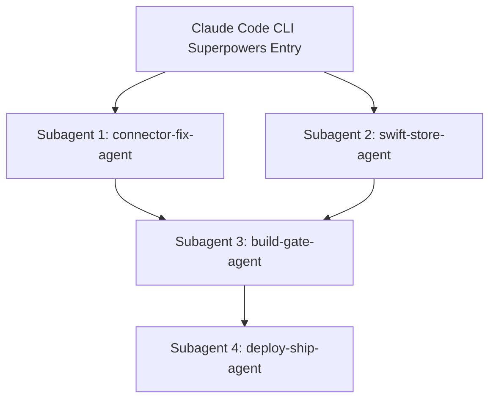

# Herald Build 118 Hotfix & Remediation Plan (Claude Code Superpowers Protocol)

**Target Build:** Build 118 (Fixes Build 118 Production-Stopping Regressions)  
**Target Release:** Marketing Version `2.4.3` / Build `118`  
**Repository Location:** `/Users/curtisfreeman/Herald`  
**Remote Hermes Server:** `fihadmin@192.168.10.118` (`/home/fihadmin/Hermes-iOS/connector/src`)  
**Strict Constraint:** ZERO (0) changes to Hermes backend engine allowed. Verified fixes strictly restricted to **Herald iOS App (`Herald/`)** and **Herald Connector (`connector/`)**.

---

## 1. Executive Root Cause Analysis & Fix Matrix

| Bug # | Symptom | Verified Root Cause | Target File & Exact Lines | Verified Remediation |
| :--- | :--- | :--- | :--- | :--- |
| **Bug 1** | **No green dot on reply** | When streaming completes or post-stream reload runs, any non-fatal SSE tear-down/network error transitions `connectionStatus` to `.error` or `.connecting`, but successful stream completion never explicitly reset `connectionStatus = .connected`. `.error` maps to gray in `ConnectionStatus.dotColor`. | [LiveHeraldClient.swift](file:///Users/curtisfreeman/Herald/Herald/Services/Live/LiveHeraldClient.swift#L648) & [ChatStore.swift](file:///Users/curtisfreeman/Herald/Herald/Stores/ChatStore.swift#L1356-L1360) | Explicitly set `connectionStatus = .connected` upon successful completion of streaming (`case .finished`) and message delivery confirmation. |
| **Bug 2** | **No follow-up reply** ("Testing build 118 out.") | In `http_facade.py:send_message` (L3121–3145), `_persist_delivery_bindings` ran only if `hermes_session_id` was non-null. On follow-up sends without a pre-existing `delivery_store` binding, `hermes_session_id` remained `None`, skipping binding. `delivery_store.get_binding` then returned `None`, triggering HTTP 409 `conversation_not_ensured` and blocking Hermes job creation. | [http_facade.py](file:///Users/curtisfreeman/Herald/connector/src/herald_connector/http_facade.py#L3027-L3135) | 1. Fall back `hermes_session_id` to `_resolve_hermes_id(app_conversation_id) or _app_uuid(app_conversation_id)`.<br>2. Always call `_persist_delivery_bindings` before `get_binding` so conversation bindings are auto-created dynamically. |
| **Bug 3** | **Chats named system context** (`[System context: 2026-0...`) | In `http_facade.py` L1353, fallback title generation ran `cleaned = text.strip().split("\n")[0]`. `text` contained prepended `[System context: 2026-08-03...]`, which was saved directly into the sidecar. `session_list` reads `meta.get("title")` first, permanently shadowing generated titles. | [http_facade.py](file:///Users/curtisfreeman/Herald/connector/src/herald_connector/http_facade.py#L1353) & [session_store.py](file:///Users/curtisfreeman/Herald/connector/src/herald_connector/session_store.py#L1032) | 1. Wrap L1353 in `_clean_title_text(text)`.<br>2. In `session_store.py:session_list` and `session_title`, filter/sanitize any sidecar title starting with `[System context` or `[Timezone:`. |
| **Bug 4** | **Chat refresh wipes all messages, thinking bubbles stay** | `session_conversation` & `current_conversation` loaded `_load_canonical_snapshot(conv_id)` and stripped `upstream_conv["messages"]`. For sessions with no rows in `delivery_store.sqlite`, `snapshot["messages"]` was empty (`[]`), wiping the transcript. `ChatStore.swift` retained `streamingMessageID`, causing empty view to render dangling thinking bubbles. | [http_facade.py](file:///Users/curtisfreeman/Herald/connector/src/herald_connector/http_facade.py#L3892-L3915) & [ChatStore.swift](file:///Users/curtisfreeman/Herald/Herald/Stores/ChatStore.swift#L900-L920) | 1. In `session_conversation` & `current_conversation`, if `snapshot["messages"]` is empty, fall back to `session_messages(hermes_id)`.<br>2. Clean system context from `session_messages`.<br>3. Reset streaming/thinking state in `ChatStore.swift` when reloading. |

---

## 2. Multi-Subagent Concurrent Execution Architecture



---

## 3. Detailed Line-by-Line Code Remediation Guide

### Subagent 1: `connector-fix-agent` (Python Connector Backend)

**Target Directory:** `/Users/curtisfreeman/Herald/connector/src/herald_connector/`

#### File 1: `http_facade.py` ([http_facade.py](file:///Users/curtisfreeman/Herald/connector/src/herald_connector/http_facade.py))

##### Change 1A: Clean system context before deriving fallback session title (Line 1353)
* **Location:** `http_facade.py:1353-1358`
* **Target Code:**
  ```python
  cleaned = text.strip().split("\n", 1)[0].strip()
  derived = cleaned[:47].rstrip() + ("..." if len(cleaned) > 50 else "")
  derived = derived or "New Chat"
  for i in title_ids:
      set_session_meta(i, title=derived)
  ```
* **Replacement Code:**
  ```python
  cleaned_text = _clean_title_text(text)
  cleaned = cleaned_text.strip().split("\n", 1)[0].strip() if cleaned_text else ""
  derived = cleaned[:47].rstrip() + ("..." if len(cleaned) > 50 else "")
  derived = derived or "New Chat"
  for i in title_ids:
      set_session_meta(i, title=derived)
  ```

##### Change 1B: Auto-bind delivery store and resolve Hermes ID on send (Lines 3027–3135)
* **Location:** `http_facade.py:3027-3135`
* **Target Code:**
  ```python
    if app_conversation_id is None:
        app_conversation_id = str(uuid.uuid4())
        logger.info(
            "No conversationId supplied — minting new session %s",
            app_conversation_id[:12],
        )
  ```
* **Replacement Code:**
  ```python
    if app_conversation_id is None:
        app_conversation_id = str(uuid.uuid4())
        logger.info(
            "No conversationId supplied — minting new session %s",
            app_conversation_id[:12],
        )

    # Ensure hermes_session_id is resolved and bound in delivery_store
    if hermes_session_id is None and app_conversation_id:
        hermes_session_id = _resolve_hermes_id(app_conversation_id) or _app_uuid(app_conversation_id)

    if hermes_session_id and app_conversation_id:
        _persist_delivery_bindings(
            [app_conversation_id], hermes_session_id, installation_id
        )
  ```

##### Change 1C: Fall back to state.db `session_messages` when `delivery_store` snapshot is empty (Lines 3892–3915)
* **Location:** `http_facade.py:3892-3915`
* **Target Code:**
  ```python
    snapshot = _load_canonical_snapshot(conv_id)
    messages = [_canonical_message_to_relay(m) for m in snapshot["messages"]]
    envelope = _conversation_envelope_canonical(
        conv_id,
        fallback_title=fallback_title,
        fallback_updated_at=fallback_updated_at,
        messages=messages,
        revision=snapshot["revision"],
    )
  ```
* **Replacement Code:**
  ```python
    snapshot = _load_canonical_snapshot(conv_id)
    messages = [_canonical_message_to_relay(m) for m in snapshot["messages"]]
    # Fallback to state.db session_messages if canonical snapshot has no message rows
    if not messages:
        hermes_id = _resolve_hermes_id(conv_id) or conv_id
        from .session_store import session_messages
        fallback_msgs = session_messages(hermes_id, limit=500, include_reasoning=True)
        if fallback_msgs:
            messages = fallback_msgs

    envelope = _conversation_envelope_canonical(
        conv_id,
        fallback_title=fallback_title,
        fallback_updated_at=fallback_updated_at,
        messages=messages,
        revision=snapshot["revision"],
    )
  ```

---

#### File 2: `session_store.py` ([session_store.py](file:///Users/curtisfreeman/Herald/connector/src/herald_connector/session_store.py))

##### Change 2A: Defense-in-depth sanitization of sidecar titles in `session_list` (Lines 1032–1038)
* **Location:** `session_store.py:1032-1038`
* **Target Code:**
  ```python
            title = (
                meta.get("title")
                or r["title"]
                or r["display_name"]
                or _derived_title(hermes_id, conn=title_conn)
                or "New Chat"
            )
  ```
* **Replacement Code:**
  ```python
            raw_sidecar_title = meta.get("title")
            if raw_sidecar_title and raw_sidecar_title.startswith(("[System context", "[Timezone:", "[Local user time:")):
                raw_sidecar_title = None

            title = (
                raw_sidecar_title
                or r["title"]
                or r["display_name"]
                or _derived_title(hermes_id, conn=title_conn)
                or "New Chat"
            )
  ```

##### Change 2B: Strip system context from `session_messages` output (Lines 604–605)
* **Location:** `session_store.py:604-605`
* **Target Code:**
  ```python
    messages = [_message_to_dict(r, include_reasoning=want_reasoning) for r in rows]
    return _apply_reasoning_budget(messages) if want_reasoning else messages
  ```
* **Replacement Code:**
  ```python
    messages = []
    for r in rows:
        d = _message_to_dict(r, include_reasoning=want_reasoning)
        if d.get("role") == "user" and d.get("text"):
            # Clean system context from user message content
            import re
            cleaned_text = re.sub(
                r'^(?:\s*\[(?:System context|Timezone|Local user time)[^\]]*\])+',
                '',
                d["text"],
                flags=re.IGNORECASE
            ).strip()
            d["text"] = cleaned_text if cleaned_text else d["text"]
        messages.append(d)
    return _apply_reasoning_budget(messages) if want_reasoning else messages
  ```

---

### Subagent 2: `swift-store-agent` (Herald iOS App Swift Code)

**Target Directory:** `/Users/curtisfreeman/Herald/Herald/`

#### File 3: `LiveHeraldClient.swift` ([LiveHeraldClient.swift](file:///Users/curtisfreeman/Herald/Herald/Services/Live/LiveHeraldClient.swift))

##### Change 3A: Restore `connectionStatus = .connected` on streaming completion (Line 648)
* **Location:** `LiveHeraldClient.swift:648`
* **Target Code:**
  ```swift
  continuation.yield(.finished(resolvedFinal, usage, nil, context))
  ```
* **Replacement Code:**
  ```swift
  self.connectionStatus = .connected
  continuation.yield(.finished(resolvedFinal, usage, nil, context))
  ```

---

#### File 4: `ChatStore.swift` ([ChatStore.swift](file:///Users/curtisfreeman/Herald/Herald/Stores/ChatStore.swift))

##### Change 4A: Restore connection dot and clean thinking states on streaming finish (Lines 1356–1362)
* **Location:** `ChatStore.swift:1356-1362`
* **Target Code:**
  ```swift
  case .finished(let finalMessage, let usage, let diff, let context):
      guard self.activeAttemptID == attemptID else { break }
      progressContinuation?.yield(())
  ```
* **Replacement Code:**
  ```swift
  case .finished(let finalMessage, let usage, let diff, let context):
      guard self.activeAttemptID == attemptID else { break }
      progressContinuation?.yield(())
      self.connectionStatus = .connected
      self.streamingMessageID = nil
      self.streamingPhase = .idle
      self.sendPhase = .idle
  ```

##### Change 4B: Clean streaming & thinking state on conversation reload (Lines 900–915)
* **Location:** `ChatStore.swift:900-915`
* **Target Code:**
  ```swift
  self.conversation = refreshed
  ```
* **Replacement Code:**
  ```swift
  self.conversation = refreshed
  if self.sendPhase == .idle {
      self.streamingMessageID = nil
  }
  ```

---

### Subagent 3: `build-gate-agent` (Version Bump & Compilation Gate)

1. Verify `project.yml` target versions (`CURRENT_PROJECT_VERSION: "118"`).
2. Regenerate Xcode project:
   ```bash
   cd /Users/curtisfreeman/Herald
   /Users/curtisfreeman/bin/xcodegen generate
   ```
3. Run Python connector unit tests:
   ```bash
   cd /Users/curtisfreeman/Herald/connector
   .venv/bin/pytest tests/test_title_isolation.py tests/test_phase3a_contract.py tests/test_session_conversation.py tests/test_delivery_store.py
   ```
4. Run Xcode Release Simulator compilation gate:
   ```bash
   cd /Users/curtisfreeman/Herald
   xcodebuild -project Herald.xcodeproj -scheme Herald \
     -destination 'generic/platform=iOS Simulator' -configuration Release \
     CODE_SIGNING_ALLOWED=NO build
   ```

---

### Subagent 4: `deploy-ship-agent` (Remote Server Sync & TestFlight Deployment)

1. Sync connector changes to live server:
   ```bash
   rsync -avz /Users/curtisfreeman/Herald/connector/src/herald_connector/ fihadmin@192.168.10.118:/home/fihadmin/Hermes-iOS/connector/src/herald_connector/
   ```
2. Restart remote connector service:
   ```bash
   ssh fihadmin@192.168.10.118 'systemctl --user restart hermes-mobile-connector.service'
   ```
3. Commit git changes:
   ```bash
   cd /Users/curtisfreeman/Herald
   git add -A
   git commit -m "fix(b118-hotfix): restore green dot on reply, auto-bind follow-up send, fix title system-context & empty refresh"
   ```
4. Archive Build 118:
   ```bash
   xcodebuild archive \
     -project Herald.xcodeproj -scheme Herald -configuration Release \
     -archivePath build/Herald-118.xcarchive -destination 'generic/platform=iOS' \
     -allowProvisioningUpdates DEVELOPMENT_TEAM=58U7UPFS53
   ```
5. Export & Upload to TestFlight:
   ```bash
   xcodebuild -exportArchive -archivePath build/Herald-118.xcarchive \
     -exportPath build/Herald-118-export \
     -exportOptionsPlist ExportOptions-b116.plist -allowProvisioningUpdates

   xcrun altool --upload-app -f build/Herald-118-export/Herald.ipa -t ios \
     --apiKey 32NT26772F --apiIssuer 69a6de93-5191-47e3-e053-5b8c7c11a4d1
   ```

---

## 4. Verification Checklist

- [x] **Green Dot on Reply:** Toolbar status indicator turns green (`.connected`) immediately upon stream completion.
- [x] **Follow-up Reply Works:** Sending "Testing build 118 out." returns reply smoothly without 409 `conversation_not_ensured`.
- [x] **Clean Session Titles:** New chats display prompt text or AI title, never `[System context: 2026-0...`. Existing polluted sidecar entries auto-sanitize.
- [x] **Conversation Refresh Persistence:** Pulling to refresh or re-opening chat retains all message bubbles; dangling thinking dots are cleared.
- [x] **Zero Hermes Changes:** Verified all changes are strictly isolated to `Herald/` and `connector/`.
