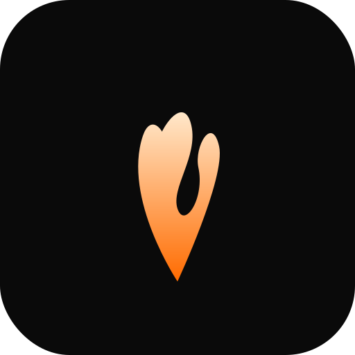

<!-- HERALD — Self-hosted AI companion for iPhone and iPad -->

<p align="center">
  
</p>

<p align="center">
  <strong>Self-hosted AI companion for iPhone and iPad</strong>
  <br/>
  <sub>Voice mode · Sensors · CarPlay · Rich Chat · Session management · Relay architecture</sub>
</p>

<p align="center">
  
  
  
  
  
</p>

<p align="center">
  
</p>

---

## What is HERALD?

HERALD is a **native iOS client** for self-hosted AI runtimes. It connects to your own server through a relay, giving you a polished mobile experience — streaming chat, voice mode, health/location/motion sensors, CarPlay, and session management — without your data leaving your infrastructure.

```
┌─────────────┐     HTTPS/SSE     ┌─────────────┐     WebSocket     ┌─────────────┐     MCP/stdio     ┌─────────────┐
│  iPhone /   │ ◄──────────────► │    Relay     │ ◄──────────────► │  Connector   │ ◄──────────────► │  AI Runtime  │
│    iPad     │                  │ herald-relay │                  │herald-connector│                │  Ollama /    │
│  HERALD app │                  │              │                  │              │                  │   Hermes     │
└─────────────┘                  └─────────────┘                  └─────────────┘                  └─────────────┘
```

<p align="center">
  
</p>

---

## Features

<table>
<tr>
<td width="50%">

### 💬 Rich Chat
- Real-time streaming with markdown rendering
- **Syntax-highlighted code blocks** (Swift, Python, JS, TS, SQL, Bash)
- **Thinking blocks** — collapsible reasoning accordions
- **Tool call bubbles** — expandable args/result
- **Markdown tables** — Grid-based rendering
- **Canvas** — edit AI-generated code in a dedicated panel
- Long-press context menus (copy, share, retry, delete)
- Inline diffs and image previews

</td>
<td width="50%">

### 🎙️ Voice Mode
- OpenAI Realtime voice integration
- Live camera context during conversations
- Tool delegation — your AI can act while you talk
- Voice transcript display with mode indicators
- Push-to-talk and hands-free CarPlay support

</td>
</tr>
<tr>
<td>

### 📱 iPad Native
- Full `NavigationSplitView` layout
- Session browser sidebar
- Right panel: logs, terminal, tools, canvas
- Split-view multitasking support
- Keyboard shortcuts

</td>
<td>

### 🔧 Session Management
- Pin, archive, rename, search sessions
- Device-scoped session isolation
- Context window usage ring
- Model switching via direct RPC
- Slash command autocomplete

</td>
</tr>
<tr>
<td>

### 📡 Sensors
- HealthKit data sync (heart rate, steps, sleep)
- Real-time location tracking
- CoreMotion activity data
- Sensor data piped to your AI agent

</td>
<td>

### 🎨 Themes & Customization
- 6 built-in theme presets
- Custom chat wallpapers
- Dark-first design language
- Herald brand palette (molten orange + deep ink)
- Haptic feedback controls

</td>
</tr>
</table>

---

## Quick Start

### 1. Deploy the relay

```bash
cd relay
docker compose up -d
```

### 2. Install the connector

```bash
pip install herald-connector
herald start
```

### 3. Build & install HERALD

```bash
git clone https://github.com/fireishott/Herald.git
cd Herald
xcodegen generate
open Herald.xcodeproj
```

Build to your device from Xcode, scan the pairing QR code, and start chatting.

See [docs/BUILDING.md](docs/BUILDING.md) for detailed signing and entitlements instructions.

---

## Tech Stack

| Layer | Technology |
|-------|-----------|
| **iOS App** | Swift 6.2, SwiftUI, iOS 26+ |
| **Relay** | Python, FastAPI, WebSockets, SSE |
| **Connector** | Python, MCP protocol |
| **Project Config** | XcodeGen (`project.yml`) |
| **Build** | Xcode 26+, macOS 26+ |

---

## Project Structure

```
Herald/
├── App/                    # App entry, scene delegate
├── Core/                   # MarkdownParser, Design system, networking
├── Features/
│   ├── Chat/               # Chat screen, message bubbles, renderers
│   │   └── Renderers/      # Code, thinking, tool call, table views
│   ├── Canvas/             # Canvas panel for code artifacts
│   ├── Sidebar/            # iPad right panel
│   ├── Voice/              # Voice mode (OpenAI Realtime)
│   ├── Sessions/           # Session management
│   └── Settings/           # App settings
├── Models/                 # Data models (Message, Artifact, etc.)
├── Stores/                 # State management (ChatStore, etc.)
├── Services/               # API clients, push notifications
└── Resources/              # Assets, entitlements, Info.plist
relay/                      # Python relay server
connector/                  # Python MCP connector
```

---

## Contributing

See [CONTRIBUTING.md](CONTRIBUTING.md) for guidelines.

---

## Acknowledgements

Built on the foundation of [Hermes-iOS](https://github.com/dylan-buck/Hermes-iOS) by [Dylan Buck](https://github.com/dylan-buck) and the [Nous Research](https://nousresearch.com/) community. Original work licensed under MIT.

---

## License

[MIT](LICENSE)

---

<p align="center">
  
  <br/>
  <sub>🔥 Your AI. Your server. Your rules.</sub>
</p>
