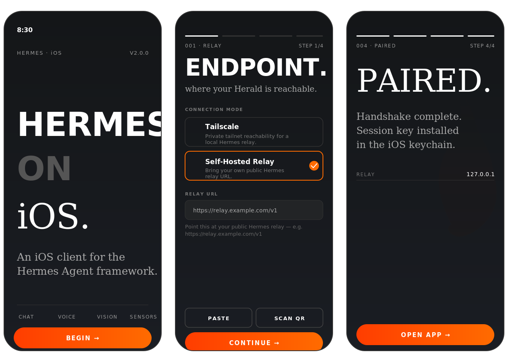
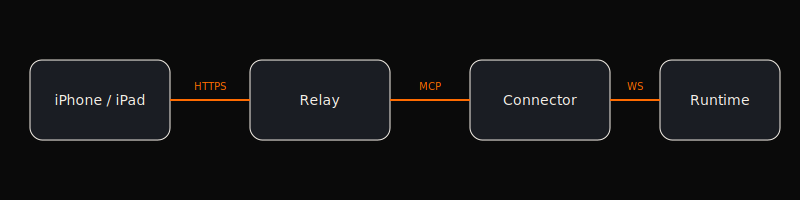

<!-- HERALD — Self-hosted AI companion for iPhone and iPad -->

<p align="center">
  
</p>

<p align="center">
  <strong>Self-hosted AI companion for iPhone and iPad</strong>
  <br/>
  <sub>Voice mode · Mimo TTS · Sensors · CarPlay · Rich Chat · Notes · Session management · Native relay</sub>
</p>

<p align="center">
  
  
  
  
  
</p>

---

## What is HERALD?

HERALD is a **native iOS client** for the [Hermes Agent](https://github.com/NousResearch/hermes-agent) framework. It connects to your self-hosted Hermes instance through a native WebSocket relay channel, giving you a polished mobile experience — streaming chat, voice mode, health/location/motion sensors, CarPlay, notes, and session management — without your data leaving your infrastructure.

HERALD is not the AI. It is the phone interface for **your** Hermes agent.

<p align="center">
  
</p>

---

## What's new in 2.0

HERALD 2.0 replaces the FastAPI relay (Docker, SQLite, polling) with a **native Hermes Relay Protocol channel** inside the connector. The gateway dials directly into the connector over WebSocket on port 8765 — no fork of hermes-agent required, no separate relay container.

- **`relay_server.py`** — NDJSON WebSocket handshake + MessageEvent exchange, built into the connector
- **~400 lines removed** from `client.py` — the job-polling loop is gone
- **Dead modules deleted** — `hermes_runner`, `hermes_gateway_executor`, `stream_contract`
- **Launch fix** — `isLaunchReady` now matches any `.networkFailure` case, so the retry screen appears correctly

<p align="center">
  
</p>

---

## iOS Platform Integrations

HERALD is a deeply native iOS app that uses platform APIs the way Apple intended. Every integration is a first-class citizen, not a wrapper.

<table>
<tr>
<td width="50%" valign="top">

### HealthKit
HERALD syncs real-time health data from Apple Health so your agent can reason about your body alongside your conversations.

- Heart rate, resting heart rate, HRV
- Step count, distance, flights climbed
- Sleep analysis (time in bed, time asleep)
- Active energy, exercise minutes
- Mindful session data
- Background delivery — data pushes to your AI even when the app is closed

</td>
<td width="50%" valign="top">

### CoreLocation
HERALD tracks your position so your agent knows where you are, where you have been, and where you are going.

- Continuous background location updates
- Significant location change monitoring
- Visit detection (arrival/departure)
- Geofence awareness
- Location data piped to your AI in real-time
- All data stays on your relay

</td>
</tr>
<tr>
<td valign="top">

### CoreMotion
HERALD reads accelerometer, gyroscope, and activity data so your agent knows your current activity state.

- CMMotionActivity (walking, running, cycling, driving, stationary)
- Step counting via CMPedometer
- Cadence, pace, distance
- Altitude changes via barometric altimeter
- Fall detection awareness
- Motion data synced to your AI context

</td>
<td valign="top">

### CarPlay
HERALD ships a full CarPlay interface for hands-free AI from your dashboard.

- Voice-driven conversation UI
- Siri integration for hands-free activation
- Session list browsing on the head unit
- Message dictation and read-back
- Navigation-aware context
- Audio session management for in-car speakers

</td>
</tr>
<tr>
<td valign="top">

### Widgets and Live Activities
HERALD ships widget extensions that keep your AI connection visible at a glance.

- **HeraldHealthWidget** — latest heart rate, step count, sleep summary
- **HeraldStatusWidget** — host online/offline, connection state, model name
- **Live Activities** — real-time streaming status on the Lock Screen
- Dynamic Island integration for voice sessions
- Widget data refreshed via App Group container
- Timeline provider with relevance-based updates

</td>
<td valign="top">

### Camera and Photos
HERALD lets you attach images from your camera or photo library, and voice mode can stream live camera context to your agent.

- Camera capture via UIImagePickerController
- Photo library picker with PHPickerViewController
- Image compression and base64 encoding for relay transport
- Live camera feed during voice mode sessions
- Image preview with fullscreen viewer

</td>
</tr>
<tr>
<td valign="top">

### Push Notifications
HERALD uses APNs with silent push to wake the app when your agent has something to deliver, even in the background.

- APNs device token registration via relay
- Silent push for background conversation sync
- Rich notifications with message previews
- Notification actions (reply, dismiss)
- Push broker architecture for token relay
- Per-device registration with Keychain storage

</td>
<td valign="top">

### AVFoundation and Speech
Voice mode uses MiMo ASR for speech recognition and MiMo TTS for synthesis, with Hermes processing.

- MiMo ASR for streaming speech-to-text
- MiMo TTS for text-to-speech synthesis
- Push-to-talk mode via HermesTalkCoordinator
- Audio session management (speaker, receiver, Bluetooth)
- Voice transcript display with live streaming

</td>
</tr>
<tr>
<td valign="top">

### Share Extension and Siri
Share content directly to HERALD from any app, and use Siri Shortcuts to trigger your AI hands-free.

- Share sheet integration for text and images
- Siri Shortcuts support
- NSUserActivity for Spotlight search
- Universal links for deep linking
- URL scheme for inter-app communication

</td>
<td valign="top">

### SwiftUI and UIKit
HERALD uses SwiftUI for the interface with UIKit where it matters — haptics, pasteboard, activity view controllers, and precise gesture handling.

- SwiftUI `NavigationSplitView` for iPad
- UIKit haptics via `UIImpactFeedbackGenerator`
- `UIPasteboard` for copy/paste
- `UIActivityViewController` for share sheets
- `UIDevice` orientation and model detection
- Scene-based lifecycle (`UISceneDelegate`)

</td>
</tr>
</table>

### Keychain and Security

All sensitive data lives in the Keychain, not UserDefaults.

- APNs device token stored as `ThisDeviceOnly`
- Session access tokens with `AfterFirstUnlock` protection
- Biometric-protected secure storage
- App Attest for push broker authentication
- No data leaves your infrastructure

---

## Features

<table>
<tr>
<td width="50%">

### Rich Chat
- Real-time streaming with markdown rendering
- Syntax-highlighted code blocks (Swift, Python, JS, TS, SQL, Bash)
- Thinking blocks — collapsible reasoning accordions
- Tool call bubbles — expandable args/result
- Markdown tables with grid-based rendering
- Canvas — edit AI-generated code in a dedicated panel
- Long-press context menus (copy, share, retry, delete)
- Inline diffs and image previews

</td>
<td width="50%">

### Session Management
- Pin, archive, rename, search sessions
- Device-scoped session isolation
- Context window usage ring
- Model switching via direct RPC
- Slash command autocomplete
- Context compaction with budget warnings
- Cron job scheduling from your phone
- Skills browser and profile switching

</td>
</tr>
<tr>
<td width="50%">

### Notes
- PencilKit handwriting editor with tool picker
- On-device handwriting recognition
- Relay CRUD with optimistic concurrency
- SHA-256 content hashing and monotonic revisions
- PDF export with document directives
- iPad split-view navigation

</td>
<td width="50%">

### Inbox and Action Center
- Push-driven action items from your agent
- Dismiss, snooze, and filter controls
- Refresh on push wake
- Directive progress tracking
- Enriched document previews

</td>
</tr>
</table>

---

## Quick Start

### 1. Install the connector

```bash
pip install herald-connector
herald start
```

The connector runs the relay server on port 8765 (WebSocket) and the HTTP API on port 8766. No separate relay container needed.

### 2. Build and install HERALD

```bash
git clone https://github.com/fireishott/Herald.git
cd Herald
xcodegen generate
open Herald.xcodeproj
```

Build to your device from Xcode, enter your relay URL in the onboarding flow, and start chatting.

See [docs/BUILDING.md](docs/BUILDING.md) for detailed signing and entitlements instructions.

---

## Tech Stack

| Layer | Technology |
|-------|-----------|
| **iOS App** | Swift 6.2, SwiftUI, UIKit, iOS 18+ |
| **Connector** | Python, WebSockets, Hermes Relay Protocol |
| **Project Config** | XcodeGen (`project.yml`) |
| **Build** | Xcode 26+, macOS 26+ |

---

## Project Structure

```
Herald/
├── App/                    # App entry, scene delegate
├── Core/                   # MarkdownParser, Design system, networking
├── Features/
│   ├── Chat/               # Chat screen, message bubbles, renderers
│   │   └── Renderers/      # Code, thinking, tool call, table views
│   ├── Canvas/             # Canvas panel for code artifacts
│   ├── Capture/            # Camera and photo capture
│   ├── Cron/               # Cron job scheduling
│   ├── Inbox/              # Action Center and push items
│   ├── Notes/              # PencilKit editor, recognition, relay sync
│   ├── Onboarding/         # Setup wizard (endpoint, permissions, pairing)
│   ├── Permissions/        # Health, location, notification grants
│   ├── Settings/           # App settings
│   ├── Sidebar/            # iPad right panel
│   ├── Skills/             # Skills browser and profile switching
│   └── Talk/               # Voice mode (MiMo ASR/TTS + Hermes)
├── Models/                 # Data models (Message, Artifact, etc.)
├── Stores/                 # State management (ChatStore, etc.)
├── Services/
│   ├── Live/               # HermesTalkCoordinator, MimoASRService, MimoTTSService
│   └── Protocols/          # Service protocols
├── Widgets/                # Home Screen widgets + Live Activities
└── Resources/              # Assets, entitlements, Info.plist
connector/                  # Python connector + relay server
```

---

## Contributing

See [CONTRIBUTING.md](CONTRIBUTING.md) for guidelines.

---

## Acknowledgements

Built on the foundation of [Hermes-iOS](https://github.com/dylan-buck/Hermes-iOS) by [Dylan Buck](https://github.com/dylan-buck) and the [Nous Research](https://nousresearch.com/) community. Original work licensed under MIT.

---

## License

[MIT](LICENSE)

---

<p align="center">
  
  <br/>
  <sub>Your AI. Your server. Your rules.</sub>
</p>
