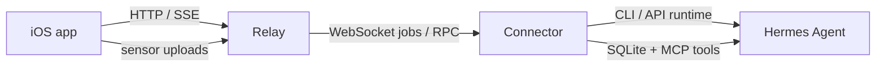

# Hermes iOS 

> [!NOTE]
> Hermes iOS is an independent community project. It is not affiliated with, endorsed by, or part of [Nous Research](https://nousresearch.com/) or the official [Hermes Agent](https://github.com/NousResearch/hermes-agent) project.

Hermes iOS is a self-hosted-first iPhone companion for a user-owned Hermes runtime. It adds a native iOS app, a public relay, and a host-side connector so Hermes can move between desktop, phone, sensors, widgets, and voice without turning your runtime into a hosted service.

<insert image> Hermes iOS chat screen showing the host connection dot, current model chip, context ring, and an inline image returned by Hermes.

## Why use it

- **Self-hosted first**: the relay is yours, the connector runs next to your Hermes install, and the iPhone app can point to any compatible relay.
- **Native iPhone experience**: chat, voice mode, camera attachments, widgets, Live Activities, and sensor-aware context.
- **Hermes-aware**: slash commands, installed skills, personalities, quick commands, MCP-backed context, and agent-side coding workflows.
- **Optional platform extras**: APNs and CarPlay are supported, but not required to get a working setup.

## What works today

- Streaming chat with retries, attachments, inline diffs, markdown/code blocks, and inline returned images
- Voice mode with OpenAI Realtime, live camera context, and Hermes tool delegation
- Dynamic slash-command catalog sourced from Hermes built-ins, installed skills, personalities, and quick-command metadata
- Health, location, motion, and sensor storage through the connector SQLite pipeline
- Home Screen widgets, Live Activities, and host/model/context status in the chat UI
- Self-hosted relay + connector pairing flow with background service support

## Architecture



The relay is the control plane. In connector mode, Hermes execution stays on the user-owned machine where the connector is installed.

> [!IMPORTANT]
> If you test on a physical iPhone against a local relay, use your Mac's LAN IP or a public URL. Do **not** use `127.0.0.1` or `localhost`; on a phone those point back to the phone itself.

## Quick start

### 1. Run the relay

```bash
cd relay
python -m venv .venv
source .venv/bin/activate
pip install -e .[dev]
cp .env.example .env
uvicorn app.main:app --reload
```

For a production-style setup, see [relay/README.md](relay/README.md) and [relay/docs/fly-io.md](relay/docs/fly-io.md).

### 2. Install and set up the connector

```bash
cd connector
python -m venv .venv
source .venv/bin/activate
pip install -e .[dev]

export HERMES_COMMAND=/absolute/path/to/hermes
export HERMES_MOBILE_RELAY_URL=https://your-relay.example.com/v1

hermes-mobile setup
```

The setup wizard can:

- use an existing relay URL
- guide you through a Fly.io relay deployment
- register the local `hermes_mobile` MCP server
- configure OpenAI Realtime talk mode
- install the connector background service

See [connector/README.md](connector/README.md) for the full flow.

### 3. Build and open the iPhone app

1. Open the project in Xcode.
2. Set your signing team and local bundle/App Group overrides if needed.
3. Launch the app on your phone or simulator.
4. Enter the same relay URL used by the connector.

<insert image> Connect Hermes screen with a custom relay URL entered and the phone pairing code ready to scan.

### 4. Pair the phone

On the connector host:

```bash
hermes-mobile pair-phone
```

Then scan the QR code or enter the manual code in the iPhone app.

### 5. Recommended: install the Hermes iOS skill in Hermes

The connector exposes the `hermes_mobile` MCP tools, but the bundled `hermes-ios` skill teaches Hermes when and how to use them well for location, health, activity, and sensor-aware responses.

From the repo root:

```bash
mkdir -p ~/.hermes/skills
cp -R skills/hermes-ios ~/.hermes/skills/
```

If you are updating an older local copy of the skill, replace it explicitly:

```bash
rm -rf ~/.hermes/skills/hermes-ios
cp -R skills/hermes-ios ~/.hermes/skills/
```

Then reload Hermes:

```text
/reload-mcp
```

Or start a fresh Hermes chat/session if you prefer.

## Optional features

> [!TIP]
> You do not need APNs or CarPlay to get a working setup. They are additive features.

- **APNs**: lets the relay deliver Hermes replies while the app is backgrounded. Setup lives in [docs/CONFIGURATION.md](docs/CONFIGURATION.md).
- **CarPlay**: requires Apple approval for the voice-based conversational entitlement. It is optional and inert when not configured.

## Documentation map

- [connector/README.md](connector/README.md): connector install, wizard flow, pairing, service management, and troubleshooting
- [relay/README.md](relay/README.md): relay setup, production checklist, API surface, and deployment notes
- [docs/CONFIGURATION.md](docs/CONFIGURATION.md): environment variables, iOS build settings, APNs, CarPlay, and private overrides
- [relay/docs/fly-io.md](relay/docs/fly-io.md): manual Fly.io deployment steps
- [relay/docs/local-dev.md](relay/docs/local-dev.md): local development and same-network testing notes
- [connector/SENSOR_SCHEMA.md](connector/SENSOR_SCHEMA.md): connector SQLite schema and MCP query surface
- [docs/IOS_CAPABILITIES.md](docs/IOS_CAPABILITIES.md): technical iOS capability ledger for maintainers
- [MAINTAINER_NOTES.md](MAINTAINER_NOTES.md): maintainer-facing implementation snapshot, not onboarding

## Screenshots to add

- `<insert image> Hermes iOS chat screen with inline returned image, tool activity, and model chip.`
- `<insert image> Connector setup wizard showing the Fly / existing relay / local network options.`
- `<insert image> Connector pair-phone output with QR code and manual pairing code.`
- `<insert image> Hermes skill install step or `/reload-mcp` confirmation in a Hermes chat session.`

## Project status

Hermes iOS is already usable as a self-hosted project, but it is still actively evolving. The public docs are optimized for getting a new user from clone to first paired chat as quickly as possible; the maintainer docs track deeper capability and architecture details.
